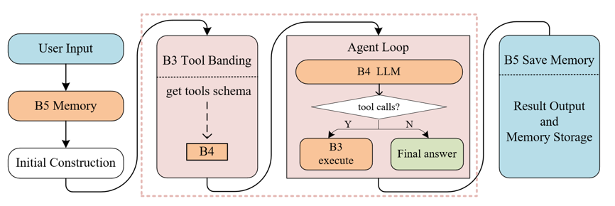

# Agent Studio：本地工具增强型 Agent 系统

本项目为实训 B 方向团队项目，基于 Python 3.10 和本地 Qwen 模型实现。系统将 Agent Runtime、Skill、Tool Layer、本地大模型和 Memory 五个模块组合为完整闭环，同时提供命令行、模块化 Web Demo 和统一 Agent Studio Web 三种运行入口。

---

## 1. 项目概述

### 1.1 项目名称

Agent Studio：本地文件驱动的工具增强型 Agent 系统

### 1.2 项目目标

本项目面向本地资料处理、数据分析和多步骤任务执行场景，目标是让本地大模型从“只生成文本”扩展为能够自主完成任务的 Agent。系统根据用户指令决定直接回答或调用工具，可检索与读取本地文件、执行计算与受限代码、分析表格、转换格式、加载历史记忆，并在多轮执行后生成基于真实证据的最终回答。

项目重点解决以下问题：

1. 通过统一消息格式连接模型决策、工具执行和运行时循环；
2. 通过 Tools Schema、参数校验和结构化错误提高工具调用可靠性；
3. 通过 Plan-and-Execute、Adaptive Execute 和 Human-in-the-Loop 支持复杂任务；
4. 通过关键词/向量记忆检索、历史压缩和工具缓存控制上下文与运行成本；
5. 通过 trace、checkpoint、JSONL 日志和批量评测实现可复现、可追踪和可审计。

### 1.3 当前完成情况

| 类型 | 完成情况 |
|---|---|
| 基础要求 | 已完成 B1 Agent Runtime、B2 Skill、B3 Tool Layer、B4 Local LLM、B5 Memory 的独立入口、标准输入输出和完整集成链路。 |
| 进阶要求 | 已实现多工具循环、并行 ToolCall、Plan-and-Execute、自适应执行、原生工具调用、断点恢复、人工确认、历史压缩、System Prompt 事件、工具缓存与重试、记忆更新/冲突处理、批量任务、Web UI 和端到端评测。 |
| 支持的主要任务类型 | 普通问答、本地文件检索与读取、文档总结与对比、数学计算、受限 Python 执行、CSV/TSV 分析、格式转换、多文件多步骤任务和基于记忆的连续对话。 |
| 当前限制 | 真实模型模式依赖服务器本地模型和 CUDA GPU；4B 模型在复杂长任务中仍可能出现格式解析或决策偏差；文件工具默认只访问配置的数据目录；轻量向量记忆检索的语义能力有限；Web 服务未设计为公网多租户系统。 |

---

## 2. 整体流程与模块结构

### 2.1 模块边界

| 模块 / 阶段 | 入口文件 / 入口函数 | 主要职责 | 输入 | 输出 |
|---|---|---|---|---|
| Web 交互层 | `ai_web/server_2.py` | 提供对话、工具、记忆、批量任务、模型配置、执行追踪和评估页面 | HTTP 请求、用户指令、页面参数 | JSON API 响应、页面状态、`outputs/web_ui/` 运行产物 |
| B1 Agent Runtime | `code/b1_agent_runtime_1.py::run_agent`；基础兼容入口 `code/b1_agent_runtime.py` | 管理消息、执行模式、工具循环、多轮对话、checkpoint、历史压缩和最终产物 | runtime JSON、B3 Schema/ToolMessage、B4 AIMessage、B5 MemoryResult | `messages.json`、`trace.json`、`final_answer.md`、checkpoint 和日志 |
| B2 Skills | `code/b2_run_skill.py::run_skill`、`skills/*.py` | 实现计算、文件读取/搜索、表格分析、格式转换、组合技能和受限代码执行 | 工具名与 JSON 参数 | 标准 `SkillResult` |
| B3 Tool Layer | `code/b3_tool_layer_1.py::get_tools_schema`、`execute_tool_calls`；兼容入口 `code/b3_tool_layer.py` | 生成 Tools Schema、校验参数、执行 ToolCall、缓存/重试并封装 ToolMessage | `configs/tools.yaml`、AIMessage 中的 `tool_calls` | Tools Schema、`ToolMessage`、调用日志与统计 |
| B4 Local LLM | `code/b4_local_agent_llm.py::generate_ai_message` | 加载本地模型，完成直接回答、工具决策、规划、执行和模式路由 | messages、Tools Schema、模型配置、推理模式 | 标准 `AIMessage`、原始模型输出、Token/耗时记录 |
| B5 Memory | `code/b5_memory.py::load_memory`、`save_memory`、`update_memory` | 记忆检索、截断、保存、更新、冲突处理和错误记忆影响分析 | query、memory IDs、运行消息/轨迹/答案、Memory 配置 | `MemoryResult`、记忆 Markdown、索引和操作日志 |
| 完整 CLI Demo | `code/run_full_demo.py` | 调用 B1 跑通 B3/B4/B5 与 B2 工具的完整链路并生成报告 | runtime、tools、memory、model 配置 | 完整 Agent 产物与 `demo_report.md` |
| 模块演示系统 | `module_demos/run_all_demo.py` | 在统一页面中独立展示 B1—B5 的输入、输出和接口关系 | 页面表单、模块样例 | `module_demos/outputs/<b1-b5>/...` |

模块间约定三种核心数据结构：

- `AIMessage`：模型生成的最终文本或 `tool_calls`；
- `SkillResult`：Skill 的状态、输入、业务输出、错误和耗时；
- `ToolMessage`：B3 将 `SkillResult` 与 `tool_call_id` 关联后的标准工具消息。

### 2.2 系统架构图

```markdown

```
完整数据流为：

```text
用户 → B1 → B5 → B1 → B3（Schema）→ B4（决策）→ B1
     → B3 → B2 → B3（ToolMessage）→ B1 → B4（最终回答）
     → 用户 / B5（可选保存记忆）
```

### 2.3 一次完整任务的流程

以“先搜索 docs 中与 tool calling 相关的文件，再读取并总结”为例：

1. 用户通过 Web 页面或 runtime JSON 提交任务，并选择 Agent 模式、模型模式、工具集和记忆策略；
2. B1 校验输入，载入 System Prompt，并调用 B5 按 ID、关键词或配置加载相关记忆；
3. B1 从 B3 获取当前工具集的 Schema，将 messages、Memory 上下文和 Schema 交给 B4；
4. 在 `adaptive_execute` 或 `plan_execute` 模式下，B4 判断任务复杂度并生成计划；
5. 模型首先请求 `local_file_search`，B3 校验参数后调用 B2，在 `data/docs/` 中返回排序后的命中文件；
6. 模型根据搜索证据请求一个或多个 `file_reader`，B3 通过 `tool_call_id` 将结果封装为 ToolMessage；
7. B1 将工具结果追加到消息序列，B4 基于真实文件内容生成最终总结；
8. B1 保存 `messages.json`、`trace.json`、`final_answer.md`、工具/模型日志和 checkpoint；
9. 若 `save_memory` 为 `conversation` 或 `global`，B5 将本次结果写入 Markdown 记忆并更新 `memory_index.json`；
10. Web 页面展示答案、实时执行步骤和最近一次 trace，批量模式还会汇总成功率、工具匹配率和耗时。

---

## 3. 模型、数据集与外部资源

### 3.1 模型说明

| 项目 | 内容 |
|---|---|
| 主要模型 | Qwen3.5-4B，本地 Transformers 推理 |
| 可选对比模型 | Qwen2.5-7B，用于模型 profile 切换与评测对比 |
| 模型来源 | 实训服务器预置模型；当前配置路径分别为 `/root/siton-tmp/assignment_B/Qwen3.5-4B` 和 `/root/siton-tmp/assignment_B/Qwen2.5-7B` |
| 项目内配置 | `configs/model.yaml`；模型权重不提交到仓库，`models/` 仅保留 `.gitkeep` |
| 是否需要 GPU | `prompt_json`、`native_tools` 和真实自适应推理需要 NVIDIA GPU；`mock` 模式不需要 GPU |
| 是否需要联网运行 | 模型和依赖安装完成后不需要；配置启用 `local_files_only: true` |
| 主要推理设置 | `bfloat16`、`device_map: cuda:0`、`max_new_tokens: 1024`、确定性生成 |

如模型不在默认服务器路径，需要修改 `configs/model.yaml` 中主模型及 `model_pool` 各 profile 的 `model_name_or_path` 和 `tokenizer_name_or_path`。本项目不在仓库内自动下载大模型权重。

### 3.2 数据集 / 示例数据说明

本项目不进行模型训练，主要使用团队自行构造的本地演示数据和评测用例。

| 数据或文件 | 用途 | 来源 | 项目内相对路径 |
|---|---|---|---|
| Agent 文档样例 | 验证文件读取、搜索、总结和多文件对比 | 团队自行构造 | `data/docs/` |
| 表格样例 | 验证 CSV/TSV 预览、列结构与统计分析 | 团队自行构造 | `data/tables/` |
| 租房决策数据 | 验证多文件对比、约束提取、预算分析和局部失败处理 | 团队自行构造 | `data/life_rent/` |
| ToolCall 输入样例 | 验证正常调用、未知工具、缺少参数、超时和组合工具 | 团队自行构造 | `data/tool_inputs/`、`data/messages/` |
| B1 Fixture | 在无 GPU 或其他模块未就绪时隔离验证 Runtime | 团队自行构造 | `data/b1_fixtures/` |
| B1 批量与恢复用例 | 验证多轮、最大轮次、断点恢复、Prompt 事件和历史压缩 | 团队自行构造 | `data/b1_cases/` |
| 端到端扩展评测集 | 22 条直接回答、单工具、多工具、规划、表格、混合和护栏任务 | 团队自行构造 | `data/messages/eval_cases_feature5_extended.json` |
| Memory 文档与索引 | 提供全局知识和历史对话检索 | 系统样例与运行生成 | `memory/global/`、`memory/conversations/`、`memory/memory_index.json` |

所有文件类工具默认以 `data/` 为根目录，因此输入中的 `docs/agent_intro.txt` 实际指向 `data/docs/agent_intro.txt`。

---

## 4. 环境安装

### 4.1 运行环境

| 项目 | 要求 |
|---|---|
| Python 版本 | Python 3.10 |
| 操作系统 / 服务器环境 | 主要验证环境为 Linux 实训服务器；Web 和 Mock 模式也可在 Windows PowerShell 运行 |
| GPU 要求 | 真实本地模型推荐 CUDA 11.8 兼容的 NVIDIA GPU；Mock 和 Fixture 模式可不使用 GPU |
| 主要依赖 | PyTorch 2.7.1、Transformers 5.12.1、Accelerate、PyYAML、NumPy、SentencePiece、Safetensors |

### 4.2 安装步骤

下载或克隆课程项目后进入项目根目录：

```bash
conda create -n agent python=3.10 -y
conda activate agent
export PYTHONNOUSERSITE=1
pip install -r requirements.txt
```

Windows PowerShell 可使用：

```powershell
conda create -n agent python=3.10 -y
conda activate agent
$env:PYTHONNOUSERSITE="1"
pip install -r requirements.txt
```

如果只使用 Mock/Fixture 调试，可以安装项目所需的基础依赖并避免加载模型；正式的 `prompt_json` 和 `native_tools` 模式必须具备 `requirements-llm.txt` 中的模型运行依赖。当前 `requirements.txt` 已包含完整依赖集合。

常见环境问题：

- **模型路径不存在**：修改 `configs/model.yaml` 中所有实际使用 profile 的模型和 tokenizer 路径；
- **CUDA/PyTorch 不兼容**：当前锁定 CUDA 11.8 wheel，需与服务器驱动和 GPU 环境匹配；
- **首次调用较慢**：Web 服务会后台预热默认模型，首次加载仍受模型大小、磁盘和 GPU 影响；
- **显存不足**：切换到 4B profile、减少输入长度，或先使用 `mock` 验证非模型模块；
- **用户级依赖污染**：设置 `PYTHONNOUSERSITE=1`，确保只加载当前 Conda 环境。

---

## 5. 输入文件与配置文件说明

### 5.1 主要配置文件

| 配置文件 | 作用 | 需要修改的字段 |
|---|---|---|
| `configs/model.yaml` | 模型后端、模型池、路由、生成参数和工具调用模式 | `model_name_or_path`、`tokenizer_name_or_path`、`device_map`；按需调整 profile 和生成长度 |
| `configs/tools.yaml` | 定义工具集、工具实现、参数 Schema、返回值和数据根目录 | `default_toolset`、`settings.data_root`、`toolsets`；新增工具时补充 `tools` 定义 |
| `configs/memory.yaml` | 定义记忆目录、索引文件和最大注入长度 | `root_dir`、`index_path`、`max_memory_chars` |
| `configs/memory_small_limit.yaml` | 复用正式 Memory，但降低长度上限以验证截断 | 通常无需修改 |
| `prompts/local_tool_agent.txt` | 默认本地工具 Agent 的 System Prompt | 可按任务要求替换或通过 Prompt 事件追加/切换 |

### 5.2 主要输入文件

| 输入文件 | 用途 | 适用场景 |
|---|---|---|
| `data/runtime_input.json` | 读取 Agent 文档并总结三点，加载并保存 Memory | 完整系统 / 基础集成 Demo |
| `data/runtime_input_adaptive_execute.json` | 自动判断并执行“搜索 → 读取 → 总结”任务 | 自适应执行 Demo |
| `data/runtime_input_plan_execute.json` | 显式先规划再检索和读取 Memory 相关文档 | Plan-and-Execute Demo |
| `data/runtime_input_react_one_round.json` | 验证一轮模型决策与工具调用 | ReAct 单轮 Demo |
| `data/batch_runtime_input.json` | 同时运行单轮和多轮 Agent 任务 | 批量执行 |
| `data/b1_cases/b1_all_features_batch.json` | 验证多工具、多轮、最大轮次、历史压缩和缓存 | B1 进阶回归 |
| `data/messages/eval_cases_feature5_extended.json` | 22 条端到端扩展用例 | 批量评测 |
| `data/messages/messages_no_tool.json` / `messages_with_tool.json` | 分别验证生成 ToolCall 和消费 ToolMessage 后生成最终回答 | B4 独立演示 |
| `data/tool_inputs/*.json` | 各 Skill 的正常、异常和边界输入 | B2/B3 模块演示 |
| `data/memory_inputs/*.json` | 保存全局/对话记忆以及更新记忆 | B5 模块演示 |

Runtime JSON 中最重要的字段包括：

- `conversation_id`：会话唯一标识；
- `user_input` / `user_inputs`：单轮或多轮用户输入；
- `agent_mode`：`integrated`、`react_one_round`、`plan_execute` 或 `adaptive_execute`；
- `toolset`：使用 `configs/tools.yaml` 中定义的工具集；
- `max_turns`：最大工具轮次，防止无限循环；
- `save_memory`：`none`、`conversation` 或 `global`；
- `history_compression`：控制历史压缩阈值、保留消息数和摘要长度；
- `tool_cache_enabled`：是否复用相同参数的工具结果。

---

## 6. 完整流程 Demo 运行

### 6.1 Demo 样例说明

| Demo | 输入文件 / 输入内容 | 演示目的 |
|---|---|---|
| Agent Studio Web | 页面输入“请先搜索 docs 目录中和 tool calling 最相关的文件，再读取最相关的结果并总结关键结论。” | 展示自适应规划、文件搜索、并行读取、实时步骤、最终回答和 trace |
| CLI Mock 完整链路 | `data/runtime_input.json` | 在无 GPU 时验证 B1、B3、B5 和 B2 工具协作，B4 使用确定性 Mock |
| CLI 真实模型完整链路 | `data/runtime_input.json` | 使用本地 Qwen3.5-4B 完成 Memory → 模型 → 工具 → 模型 → Memory 闭环 |
| B1—B5 Module Studio | 页面内置模块样例 | 独立检查各模块输入、标准输出、接口去向和运行产物 |
| 端到端批量评测 | `data/messages/eval_cases_feature5_extended.json` | 复现直接回答、工具匹配、参数完整性和整体成功率 |

### 6.2 运行命令

#### Demo 1：统一 Agent Studio Web（推荐）

```bash
python ai_web/server_1.py
```

浏览器打开 `http://127.0.0.1:8010/`。远程服务器运行时需要转发 8010 端口。可通过以下命令关闭模型预热：

```bash
python ai_web/server.py --no-warmup
```

#### Demo 2：无 GPU 的 Mock 完整链路

```bash
python code/run_full_demo.py \
  --input data/runtime_input.json \
  --tools_config configs/tools.yaml \
  --memory_config configs/memory.yaml \
  --model_config configs/model.yaml \
  --llm_mode mock \
  --outdir outputs/full_demo_mock
```

#### Demo 3：真实本地模型完整链路

```bash
python code/run_full_demo.py \
  --input data/runtime_input.json \
  --tools_config configs/tools.yaml \
  --memory_config configs/memory.yaml \
  --model_config configs/model.yaml \
  --llm_mode prompt_json \
  --outdir outputs/full_demo
```

该输入配置为 `save_memory=conversation`，会更新对应对话记忆。重复运行前应确认是否接受覆盖同一 `conversation_id` 的 Memory。

#### Demo 4：B1—B5 统一模块演示

```bash
python module_demos/run_all_demo.py
```

浏览器打开 `http://127.0.0.1:8100/`，可使用 `#b1` 至 `#b5` 直接进入对应模块。

#### Demo 5：22 条端到端评测

```bash
python code/b1_agent_runtime_1.py \
  --eval_cases data/messages/eval_cases_feature5_extended.json \
  --tools_config configs/tools.yaml \
  --memory_config configs/memory.yaml \
  --model_config configs/model.yaml \
  --agent_mode adaptive_execute \
  --toolset basic_tools \
  --llm_mode prompt_json \
  --save_memory none \
  --max_turns 3 \
  --max_plan_steps 6 \
  --evidence_policy lite \
  --outdir outputs/b1_e2e_eval_reproduce
```

### 6.3 关键参数说明

| 参数 | 说明 |
|---|---|
| `--input` | 单个 Runtime JSON 输入文件 |
| `--batch_input` | 包含多个 B1 任务的批量 JSON |
| `--eval_cases` | 端到端评测用例文件 |
| `--tools_config` | 工具注册与工具集配置 |
| `--memory_config` | Memory 路径、索引和长度限制配置 |
| `--model_config` | 模型、模型池、路由和生成参数配置 |
| `--agent_mode` | 选择普通、单轮工具、Plan 或自适应执行方式 |
| `--llm_mode` | `mock`、`prompt_json`、`native_tools` 或增强 Runtime 的 `adaptive` |
| `--toolset` | 指定工具集合，如 `basic_tools` 或 `advanced_tools` |
| `--max_turns` | 最大工具轮次，达到上限后停止请求新工具 |
| `--max_plan_steps` | Plan-and-Execute 的最大计划步骤数 |
| `--evidence_policy` | `strict` 强证据策略或 `lite` 轻量证据策略 |
| `--save_memory` | 控制是否保存对话或全局记忆 |
| `--resume` | 从输出目录中的 `checkpoint.json` 恢复执行 |
| `--outdir` | 本次运行的产物目录 |

### 6.4 运行成功的判断方式

- 终端退出码为 0，并打印 `final_answer.md`、`demo_report.md` 或评测报告路径；
- `trace.json` 中 `status` 为 `success`，复杂交互任务也可能按预期返回 `needs_user`；
- `messages.json` 至少包含 system、user 和 assistant；工具任务还应包含 assistant 的 `tool_calls` 与对应 ToolMessage；
- `final_answer.md` 非空，并与输入任务相关；
- `tool_call_log.jsonl` 中工具调用状态正确，`tool_call_id` 能与消息记录对应；
- 真实模型模式下，`llm_calls/` 生成 raw output 和标准 AIMessage；
- 完整 Demo 生成 `demo_report.md`，批量评测生成 `eval_summary.json`、`eval_report.csv` 和 `eval_report.md`。

---

## 7. 输出文件与结果说明

### 7.1 主要输出文件

| 输出文件 | 生成模块 / 阶段 | 格式 | 说明 |
|---|---|---|---|
| `outputs/full_demo/final_answer.md` | B1/B4 | Markdown | 最终返回给用户的回答 |
| `outputs/full_demo/messages.json` | B1 | JSON 数组 | 完整 system/user/assistant/tool 消息序列 |
| `outputs/full_demo/trace.json` | B1 | JSON | 状态、Agent 模式、模型调用、工具轮次、计划、警告和错误 |
| `outputs/full_demo/checkpoint.json` | B1 | JSON | 中断、人工确认和恢复执行所需状态 |
| `outputs/full_demo/selected_memory.json` | B5 | JSON | 本次加载的 Memory、字符数、截断与错误 |
| `outputs/full_demo/saved_memory.json` | B5 | JSON | 保存后的 memory ID、类型、路径和元数据 |
| `outputs/full_demo/tools_schema.json` | B3 | JSON | 当前工具集对应的函数工具 Schema |
| `outputs/full_demo/tool_messages.json` | B3/B1 | JSON 数组 | 带 `tool_call_id` 的标准 ToolMessage |
| `outputs/full_demo/tool_call_log.jsonl` | B3 | JSONL | 参数、状态、缓存、重试和耗时等工具执行明细 |
| `outputs/full_demo/llm_calls/` | B4 | JSON/JSONL | 每次模型调用的原始输出、解析后 AIMessage 和运行日志 |
| `outputs/full_demo/demo_report.md` | 完整 Demo | Markdown | 汇总状态、消息流、轮次、工具、Memory、答案和文件清单 |
| `outputs/web_ui/<conversation>/<timestamp>/` | Agent Studio Web | 多种格式 | Web 每次任务的隔离运行目录 |
| `outputs/b1_e2e_eval_feature5_v4/` | 端到端评测 | JSON/CSV/Markdown | 评测汇总、逐用例结果和完整运行产物 |

日志类文件采用 JSONL 追加记录，主要结果 JSON 通常保存当前运行快照。Memory 保存会更新 `memory/conversations/` 或 `memory/global/` 以及 `memory/memory_index.json`。

### 7.2 运行结果示例

仓库中保留的完整 Demo 记录 `outputs/full_demo/demo_report.md` 显示：

```text
Status: success
Message flow: system → user → assistant → tool → assistant → tool → assistant
Tool rounds: 2
LLM calls: 3
Loaded memory documents: 2
```

`outputs/b1_e2e_eval_feature5_v4/eval_summary.json` 中留存的一组评测结果如下：

| 指标 | 结果 |
|---|---:|
| 用例数 | 22 |
| 成功率 | 100% |
| 结构化输出率 | 100% |
| 工具匹配率 | 100% |
| 参数完整率 | 100% |
| 平均输入 Token | 7986.52 |
| 平均输出 Token | 238.48 |
| 平均耗时 | 22.507 秒 |

以上指标对应仓库内指定扩展用例、`adaptive_execute + prompt_json + qwen_4b` 的一次留存记录，用于复现实验和回归比较，不代表所有开放任务都能达到相同结果。

可视化结果可通过以下页面查看：

- Agent Studio `http://127.0.0.1:8010/`：对话、执行步骤、工具、Memory、批量任务、trace 和评估；
- Module Studio `http://127.0.0.1:8100/`：B1—B5 独立模块输入输出与接口关系。

---

## 8. 协作实现说明

团队按照 B1—B5 的模块边界并行实现，通过公共数据结构、配置文件和固定样例降低联调成本。

1. **统一数据契约**：在 `code/common/schemas.py` 中统一 AIMessage、SkillResult 和 ToolMessage 的字段与校验逻辑，模块间不直接传递非标准对象；
2. **配置与实现解耦**：B3 通过 `configs/tools.yaml` 注册 Skill，B4 通过 `configs/model.yaml` 选择模型与 profile，B5 通过 `configs/memory.yaml` 管理路径和长度；
3. **支持隔离开发**：B1 Fixture 预置 Memory、Schema、AIMessage 和 ToolMessage；B4 Mock 不加载 GPU 模型，使各模块可以独立开发和验收；
4. **提供双层联调入口**：`module_demos/` 用于逐模块确认输入输出，`ai_web/` 和 `run_full_demo.py` 用于验证完整端到端流程；
5. **统一错误格式**：Skill 业务错误写入 `SkillResult.error`，B3 将其封装为 ToolMessage，B1 决定重试、继续、请求人工确认或结束，避免异常跨模块失控；
6. **保留可审计产物**：每次运行输出 messages、trace、模型原始输出、工具日志和 Memory 操作记录，便于成员复现和定位接口问题；
7. **回归验证**：使用 `test/` 中的单元测试和 `data/messages/eval_cases_feature5_extended.json` 批量用例覆盖 Runtime 交接、代码沙箱、Memory 摘要、原生工具降级、Plan 快速路径和 Web 并发任务。

只有多模块协作后才能完成的功能包括：基于 Memory 的工具规划、模型 ToolCall 到真实 Skill 的执行闭环、工具错误后的重规划、完整 trace、对话记忆保存以及 Web 实时进度展示。

---

## 9. 已知问题与改进方向

| 问题 | 当前原因 | 可能改进 |
|---|---|---|
| 模型路径依赖实训服务器 | `configs/model.yaml` 使用服务器绝对路径，权重未随仓库分发 | 提供环境变量覆盖、模型探测脚本和统一下载/挂载说明 |
| 复杂任务偶发输出解析或工具决策偏差 | 4B 模型能力和结构化格式遵循能力有限，长上下文会增加难度 | 优化 Prompt 与 Schema 描述，增加约束解码，使用更强模型并扩充失败用例回归 |
| 真实模式资源消耗较高 | 本地 Transformers 推理依赖显存，首次加载和多次规划会增加耗时 | 使用量化模型、KV Cache、模型服务化、请求队列和更细粒度的路由策略 |
| 向量 Memory 的语义表达有限 | 当前为轻量本地向量方案，适合离线演示但不等同于专用 Embedding 模型 | 接入可配置的本地 Embedding 模型和向量数据库，增加阈值标定与去重 |
| 文件工具范围有限 | 出于安全与可复现考虑，默认限制在 `data_root`，并重点支持本地文本和表格 | 增加 PDF/Office 解析、编码探测和细粒度目录授权，同时保留路径沙箱 |
| Memory 和输出会持续增长 | 每次对话、日志和评测都会生成文件，当前主要依靠目录隔离 | 增加归档、容量上限、过期清理、Memory 版本和回滚机制 |
| Web 服务不适合直接暴露公网 | 当前使用 Python 标准库 HTTP Server，未实现身份认证、权限和生产部署安全策略 | 接入正式 Web 框架、认证、任务队列、限流和 HTTPS，仅在可信网络内开放现版本 |

后续将优先完善可移植模型配置、真实 Embedding Memory、长任务稳定性和生产化 Web 部署，并继续扩充多工具、部分失败、人工确认和恢复执行的回归评测集。
